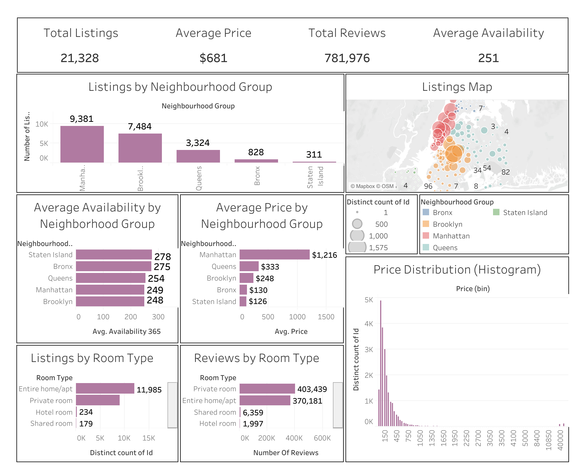

# ➤ Airbnb NYC Market Dashboard (Tableau) (2025)

Interactive Tableau dashboard analyzing New York City’s Airbnb market across listings, pricing, availability, and guest engagement.

---

 https://public.tableau.com/views/AirbnbNewyork_17631581845800/Dashboard?:embed=y  

---

## Project Overview
This project explores the NYC Airbnb market to identify trends in:
- listing volume by borough/neighborhood
- pricing differences across locations
- room type supply patterns
- availability distribution
- guest engagement through review activity

The final output is a market intelligence dashboard designed for **quick decision-making** and **exploratory analysis**, suitable for business stakeholders.

---

## Business Questions
This dashboard was designed to answer key stakeholder questions such as:

1. **How large is the NYC Airbnb market overall?**
2. **Which boroughs dominate supply and pricing?**
3. **What room types are most common—and which generate the most engagement?**
4. **Which neighborhoods show high availability vs high demand?**
5. **What does Airbnb pricing distribution look like in NYC?**

---

## KPIs Tracked
The dashboard is anchored around four core KPIs:

- **Total Listings** — total number of Airbnb listings
- **Average Price** — average nightly price across listings
- **Total Reviews** — overall guest review volume (proxy for demand/engagement)
- **Average Availability** — average days available (proxy for market saturation)

These KPIs provide a high-level snapshot before diving into deeper visuals.

---

## Data Preparation (Cleaning + Feature Engineering)
Before building the dashboard, the dataset was cleaned and standardized to ensure accurate KPI reporting and consistent grouping across visuals.

**Key steps included:**
- removed nulls and duplicates  
- standardized inconsistent neighborhood/group labels  
- fixed measure/dimension data types  
- created calculated fields for dashboard KPIs  
- validated aggregation levels for pricing and availability metrics  

---

## Dashboard Design Strategy
The dashboard was structured to support both:
- **executive summary** viewing (top KPIs)
- **deep exploration** via segmented visuals

### Visuals Included
1. **Listings by Neighborhood Group**  
   Identifies boroughs dominating supply.

2. **Geographic Map of Listings**  
   Visualizes listing density and hotspot clusters.

3. **Average Availability by Neighborhood**  
   Highlights neighborhoods with the most open supply.

4. **Average Price by Neighborhood**  
   Reveals pricing gaps across NYC.

5. **Listings by Room Type**  
   Shows which room types dominate the market.

6. **Reviews by Room Type**  
   Tracks guest engagement patterns by listing type.

7. **Price Distribution Histogram**  
   Shows overall pricing spread and the presence of outliers/luxury listings.

---

## ✨ Key Insights
- **Manhattan leads** in both listing volume and average price.
- **Brooklyn follows closely** in listing volume but at generally lower prices.
- **Bronx and Staten Island** show noticeably higher availability, suggesting lower occupancy/market demand.
- **Private rooms and entire homes** dominate the supply side, and private rooms lead in review volume.
- Pricing shows a **right-skewed distribution**, with most listings under a common threshold and a long tail of luxury listings.

---

## Recommendations / Business Takeaways
If this dashboard were used by a real stakeholder (host, investor, marketplace operator), the data suggests:

- **Pricing strategy should vary by borough** — Manhattan supports premium pricing, while outer boroughs benefit from competitive pricing.
- **Neighborhood availability is a strong signal** — high availability may point to areas where demand is weaker or supply is under-optimized.
- **Room type matters for engagement** — private rooms consistently generate strong guest activity and reviews.
- **Luxury listings drive outliers** — pricing analysis should account for skew and outliers when forecasting.

---

## Tools Used
- **Tableau Public / Tableau Desktop**
- Excel (basic inspection / dataset review)

---

## Skills Demonstrated
- Dashboard Design + Layout Structuring (Tableau)
- KPI Development
- Exploratory Data Analysis (EDA)
- Data Cleaning & Preparation
- Market Segmentation
- Visual Storytelling for Stakeholders

---

